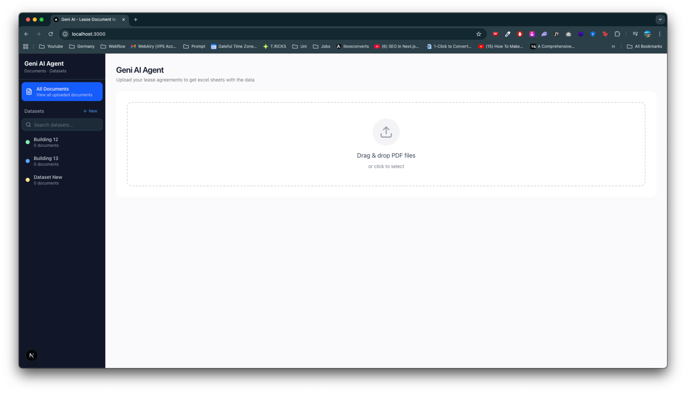
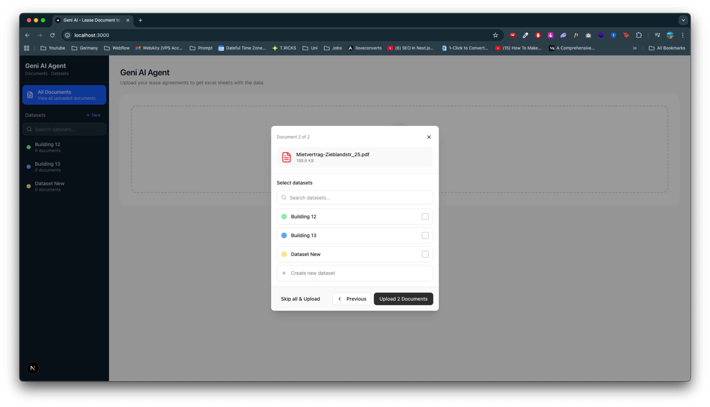
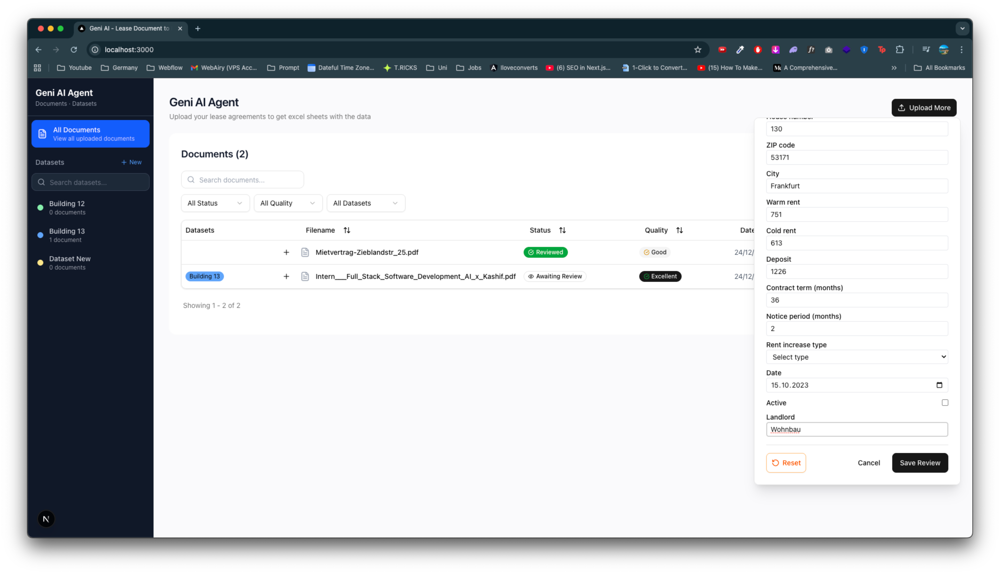
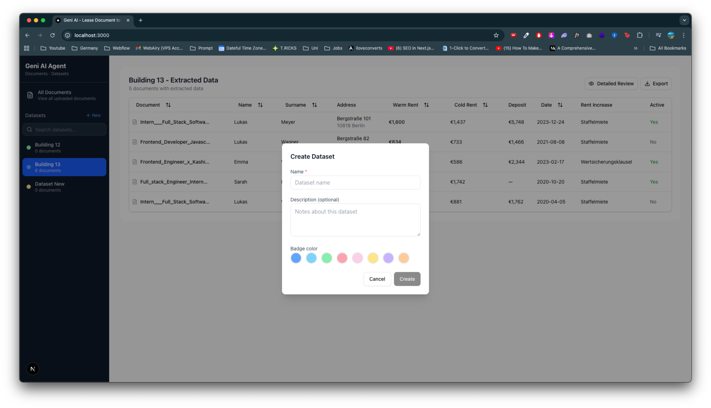
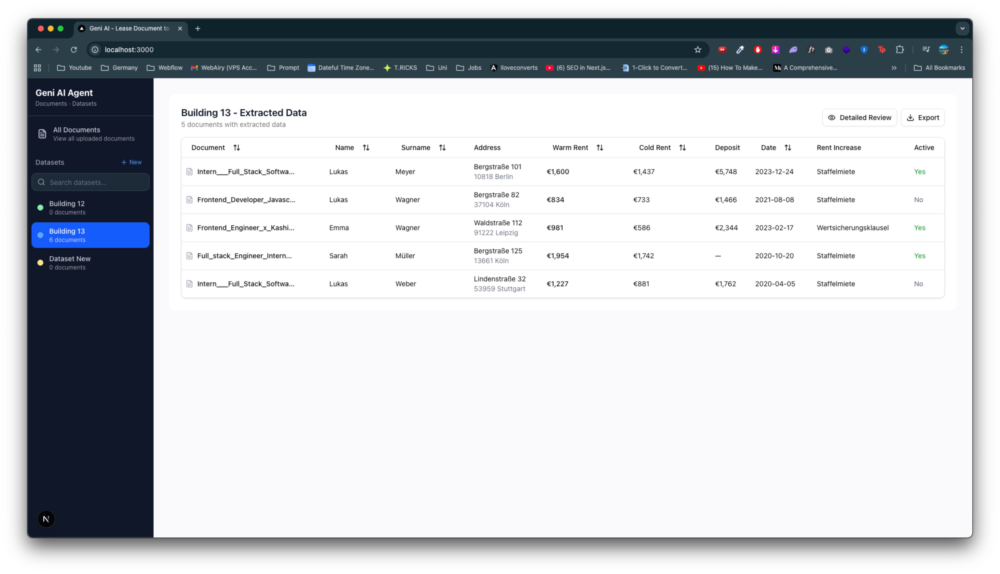
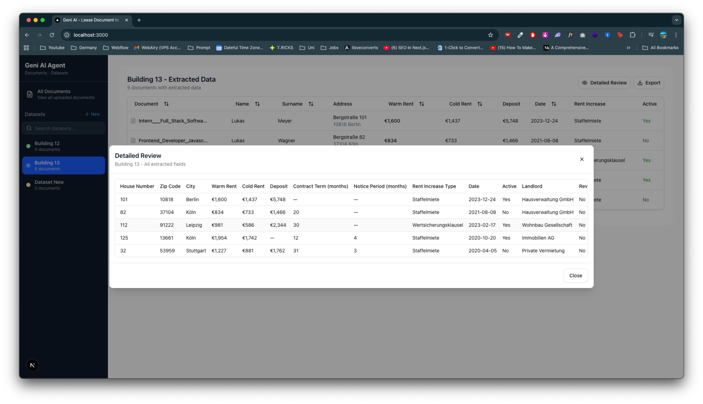
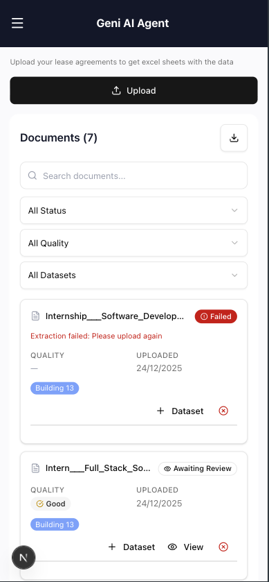

# Geni AI Agent - Lease Document Data Extraction

A Next.js application that allows users to upload lease agreement documents and automatically extract structured data into organized datasets for export to Excel/CSV.


---

## Table of Contents

- [What Was Built](#-what-was-built)
- [Getting Started](#-getting-started)
- [Usage Guide](#-usage-guide)
- [Screenshots](#-screenshots)
- [Test Notes](#-test-notes)
- [What's Next](#-whats-next)

---

## What Was Built

This project is a **document processing platform** designed for lease agreement management. The application provides:

### Core Functionality

1. **Document Upload System** - Drag-and-drop file upload with progress tracking
2. **Data Extraction Pipeline** - Automated extraction of lease data (names, addresses, rent amounts, contract terms)
3. **Dataset Management** - Create, organize, and manage collections of documents
4. **Review Workflow** - Quality scoring and field-by-field review capabilities
5. **Data Export** - Export extracted data to CSV format

### Key Components Built

- **Dropzone Component** - Interactive file upload with dataset assignment
- **Documents Table** - TanStack Table with sorting, filtering, pagination, and inline editing
- **Dataset Sidebar** - Navigation and dataset management with search functionality
- **Dataset Data Table** - Consolidated view of extracted data per dataset
- **Field Editor** - Inline editing for extracted data fields
- **Quality Badge** - Visual indicator of extraction confidence scores
- **Review Modals** - Detailed and manage dataset modals for data review

---

## Getting Started

### Prerequisites

- Node.js 18+
- npm, yarn, pnpm, or bun

### Installation

1. **Clone the repository**

   ```bash
   git clone https://github.com/iamknk/intern
   cd intern
   ```

2. **Install dependencies**

   ```bash
   npm install
   # or
   yarn install
   # or
   pnpm install
   ```

3. **Run the development server**

   ```bash
   npm run dev
   # or
   yarn dev
   # or
   pnpm dev
   ```

4. **Open in browser**

   Navigate to [http://localhost:3000](http://localhost:3000)

## Usage Guide

### 1. Upload Documents

- Drag and drop files onto the upload zone, or click to browse
- Select one or more datasets to organize your documents
- Monitor upload and processing progress

### 2. View Documents

- All uploaded documents appear in the main table
- Use filters to narrow down by status (Queued, Processing, Done, etc.)
- Search by filename
- Sort any column by clicking the header

### 3. Review Extracted Data

- Click the eye icon to view extracted data
- Edit fields inline if corrections are needed
- Mark as "Reviewed" when verified

### 4. Manage Datasets

- Create new datasets from the sidebar
- Assign documents to multiple datasets
- View consolidated data per dataset

### 5. Export Data

- Navigate to a dataset view
- Click "Export CSV" to download extracted data

---

## Screenshots

### Home / Upload View




### Documents Table


### Field Editor / Review Modal



### Dataset Data View






### Mobile Responsive View



---

## Test Notes

### Manual Testing Checklist

#### Upload Functionality

- [ ] Drag and drop single file uploads correctly
- [ ] Multiple file upload works
- [ ] Error states display for failed uploads

#### Documents Table

- [ ] Documents appear after upload
- [ ] Status badges update correctly (queued → processing → done)
- [ ] Sorting works on all columns
- [ ] Filtering by status works
- [ ] Search filters documents by filename
- [ ] Pagination works correctly
- [ ] Row selection works

#### Dataset Management

- [ ] Create new dataset modal opens
- [ ] Dataset appears in sidebar after creation
- [ ] Dataset search filters correctly
- [ ] Clicking dataset filters document view
- [ ] Document count updates correctly

#### Data Extraction & Review

- [ ] Extracted data displays correctly
- [ ] Field editor allows inline editing
- [ ] Changes save properly
- [ ] Quality score displays
- [ ] Mark as reviewed updates status

#### Export

- [ ] CSV export generates correct file
- [ ] All fields included in export
- [ ] Export works with empty datasets (shows message)

#### Responsive Design

- [ ] Mobile menu opens/closes correctly
- [ ] Tables scroll horizontally on mobile
- [ ] Touch targets are accessible
- [ ] All modals work on mobile

### Known Issues / Edge Cases

- Document processing is showing mock data

---

## What's Next

### Planned Features

1. **Backend Integration**

   - Database persistence (PostgreSQL, MongoDB)
   - User authentication and authorization

2. **Advanced Data Management**

   - Duplicate detection for documents
   - JSON exports
   - Comments and annotations
   - Processing Statistics
   - Filtering inside the datasets
